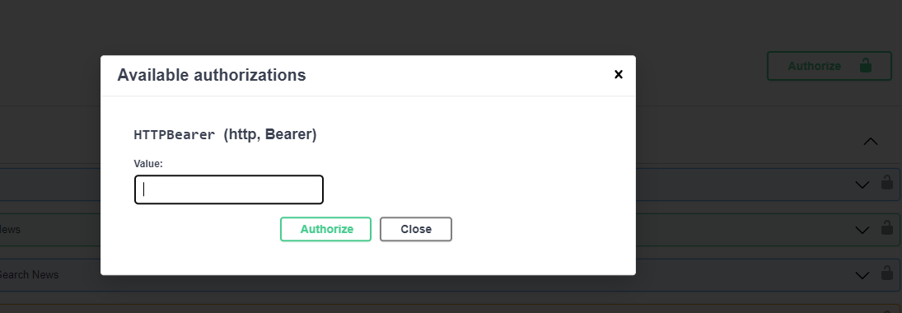
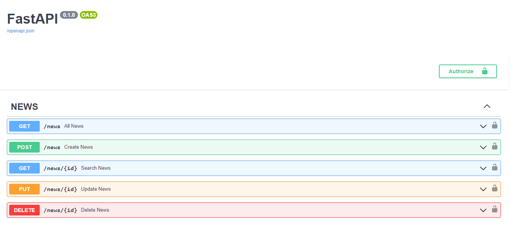

# Info News API (FASTAPI/MONGODB) 🚀

# Manage news NOSQL data 

# Getting Started

First clone the repository from Github and switch to the new directory:

    $ git clone https://github.com/ffmatheus/info-news-back.git

If you are using Windows:

Install docker and docker-compose:

    https://docs.docker.com/desktop/install/windows-install/
    https://docs.docker.com/compose/

With Docker Desktop opened, run:

    $ docker-compose up --build
    
# Endpoints docs

With docker-compose running and application builded, you can access the swagger by localhost link:

    http://localhost:8000/docs

To run news endpoints, you need first create a user in /register endpoint, after that, /login and get the token. Use the token on Authorize 

Now you can access all endpoints.

Enjoy ! 

# First look

